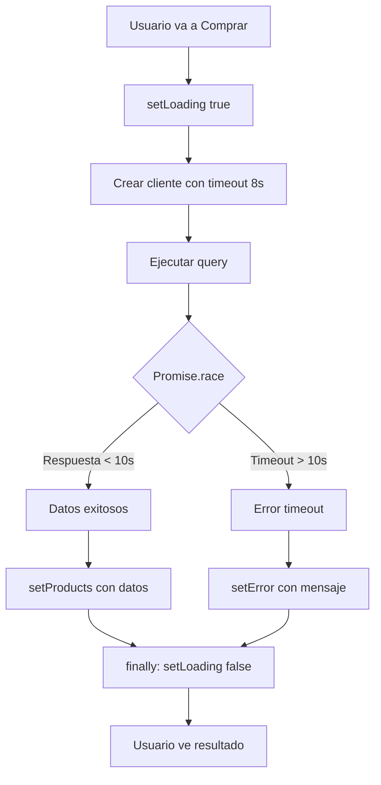

# ✅ Solución: Carga Infinita de Productos

## 🐛 Problema Identificado

**Síntoma:** Después de navegar por la aplicación unos minutos, al volver a "Comprar" la página se queda en "Cargando productos..." eternamente.

**Causa Raíz:** Las peticiones a Supabase **NO tenían timeout**, entonces cuando la conexión se volvía lenta o había problemas de red, las promesas se quedaban esperando indefinidamente sin resolverse ni rechazarse.

---

## 🔧 Solución Implementada

### 1. **Cliente Optimizado con Timeout**

Se agregó el uso del cliente optimizado `createSupabaseClientWithTimeout` que ya existía en el proyecto pero no se usaba en el hook `useProducts`.

### 2. **Timeout de Seguridad Dual**

Se implementó un sistema de timeout doble:

- **Timeout del cliente**: 8 segundos (nivel fetch)
- **Timeout de Promise.race**: 10 segundos (nivel aplicación)

Esto asegura que **SIEMPRE** se resuelva la promesa, ya sea con datos o con error.

### 3. **Manejo Mejorado de Errores**

Se agregó detección específica de tipos de error:

- ⏰ **Timeout**: "La conexión está lenta. Intenta recargar la página."
- 🌐 **Error de red**: "Error de conexión. Verifica tu internet."
- ❌ **Error general**: Mensaje descriptivo del error

### 4. **Garantía de setLoading(false)**

El bloque `finally` **SIEMPRE** se ejecuta, independientemente del error:

```typescript
finally {
  setLoading(false);
  console.log('✅ Carga finalizada (loading = false)');
}
```

---

## 📝 Código Antes vs Después

### ❌ Antes (PROBLEMA):

```typescript
// Sin timeout - se queda esperando eternamente
const { data, error } = await supabase
  .from('productos')
  .select('*');
```

### ✅ Después (SOLUCIÓN):

```typescript
// Con timeout doble
const optimizedClient = createSupabaseClientWithTimeout(8000);

const queryPromise = optimizedClient
  .from('productos')
  .select('*');

const timeoutPromise = new Promise<never>((_, reject) => {
  setTimeout(() => reject(new Error('Timeout cargando productos')), 10000);
});

const { data, error } = await Promise.race([queryPromise, timeoutPromise]);
```

---

## 🎯 Cambios Realizados

### Archivo: `src/hooks/useProducts.ts`

#### 1. Import del cliente optimizado:
```typescript
import { supabase, createSupabaseClientWithTimeout } from '../lib/supabase';
```

#### 2. Función `fetchProducts`:
- ✅ Usa `createSupabaseClientWithTimeout(8000)`
- ✅ Implementa `Promise.race` con timeout de 10s
- ✅ Detecta tipo de error (timeout, red, general)
- ✅ Logs detallados para debug
- ✅ `finally` garantizado con `setLoading(false)`

#### 3. Función `fetchCategories`:
- ✅ Mismas mejoras que `fetchProducts`
- ✅ Timeout de 10s
- ✅ Fallback a categorías demo
- ✅ `setLoading(false)` garantizado

---

## 🔍 Logs de Debug

Ahora verás estos logs en la consola del navegador (F12):

### Carga Exitosa:
```
📦 Cargando productos desde Supabase...
✅ 17 productos cargados exitosamente
✅ Carga de productos finalizada (loading = false)
```

### Timeout:
```
📦 Cargando productos desde Supabase...
❌ Error cargando productos: Timeout cargando productos - conexión muy lenta
⏰ Timeout al cargar productos - la conexión está muy lenta
✅ Carga de productos finalizada (loading = false)
```

### Error de Red:
```
📦 Cargando productos desde Supabase...
❌ Error cargando productos: fetch failed
🌐 Error de red al cargar productos
✅ Carga de productos finalizada (loading = false)
```

---

## 📊 Timeouts Configurados

| Componente | Timeout Cliente | Timeout Promise.race | Total Máximo |
|------------|----------------|---------------------|--------------|
| Productos | 8000ms (8s) | 10000ms (10s) | 10 segundos |
| Categorías | 8000ms (8s) | 10000ms (10s) | 10 segundos |

**Resultado:** Nunca más se quedará cargando por más de 10 segundos.

---

## 🧪 Cómo Probar

### Prueba 1: Funcionamiento Normal

1. Ve a "Comprar"
2. Deberías ver los productos cargando rápidamente
3. En consola: `✅ X productos cargados exitosamente`

### Prueba 2: Simular Conexión Lenta

1. Abre DevTools (F12) → Network tab
2. Cambia a "Slow 3G" o "Offline"
3. Ve a "Comprar" o recarga la página
4. Después de máximo 10 segundos:
   - Verás mensaje de error claro
   - Ya no estará en "Cargando..."
   - En consola: `⏰ Timeout al cargar productos`

### Prueba 3: Navegar Entre Páginas

1. Inicia sesión
2. Ve a "Comprar" → carga productos ✅
3. Ve a "Perfil"
4. Ve a "Admin"
5. Vuelve a "Comprar"
6. Productos cargan normalmente (o timeout en máx 10s)

---

## 🎨 Mensajes de Usuario

### Para usuarios con cuenta real:

#### ✅ Carga exitosa:
- Muestra productos normalmente
- Sin mensaje de error

#### ⏰ Timeout:
- Mensaje: "La conexión está lenta. Intenta recargar la página o volver más tarde."
- Productos: Array vacío
- Puede intentar recargar

#### 🌐 Error de red:
- Mensaje: "No se pudieron cargar los productos. Verifica tu conexión."
- Productos: Array vacío

### Para modo demo:

- ✅ Siempre muestra productos demo como fallback
- ⚠️ Mensaje: "Usando productos demo - hay problemas de conexión con la base de datos"

---

## 🔄 Flujo de Carga Mejorado



---

## ⚙️ Configuración Recomendada

Si quieres ajustar los timeouts:

```typescript
// En useProducts.ts

// Timeout del cliente (nivel fetch)
const optimizedClient = createSupabaseClientWithTimeout(8000); // 8 segundos

// Timeout de seguridad (nivel aplicación)
const timeoutPromise = new Promise<never>((_, reject) => {
  setTimeout(() => reject(new Error('Timeout...')), 10000); // 10 segundos
});
```

**Recomendación:**
- Timeout del cliente: 6-10 segundos
- Timeout de Promise.race: 2-3 segundos más que el del cliente
- Total: No más de 15 segundos para buena UX

---

## 🐛 Solución de Problemas

### ❌ Aún se queda en "Cargando..."

**Verificar:**
1. ¿Se ejecutó el `setLoading(false)` en consola?
   - Si NO: Hay un problema grave, revisar código
   - Si SÍ: El problema es visual/UI, revisar componente BuyPage

2. ¿Hay errores en consola?
   - Revisar mensaje exacto
   - Verificar conectividad a Supabase

### ❌ Los productos cargan muy lento (pero cargan)

**Posibles causas:**
- Conexión lenta a internet
- Supabase en región lejana
- Muchos productos en BD

**Solución:**
- Reducir timeout si quieres mensaje más rápido
- Implementar paginación
- Agregar caché local

### ❌ Siempre muestra productos demo

**Verificar:**
1. ¿Estás logueado con usuario real?
2. ¿Hay productos en Supabase?
3. ¿La URL de Supabase es correcta en .env?

---

## 🚀 Beneficios del Fix

### Para el Usuario:
- ✅ Nunca más loading infinito
- ✅ Mensaje claro cuando hay problemas
- ✅ Puede intentar de nuevo
- ✅ Mejor experiencia general

### Para el Desarrollador:
- ✅ Logs detallados para debug
- ✅ Control total sobre timeouts
- ✅ Manejo de errores robusto
- ✅ Código más mantenible

### Para el Sistema:
- ✅ No se acumulan promesas pendientes
- ✅ Mejor uso de recursos
- ✅ Previene memory leaks
- ✅ Rendimiento estable

---

## 📋 Resumen Técnico

**Problema:** Promesas sin timeout → Loading infinito

**Solución:**
1. Cliente optimizado con timeout (8s)
2. Promise.race con timeout adicional (10s)
3. Manejo de errores mejorado
4. Finally garantizado

**Resultado:** Máximo 10 segundos de carga, siempre resuelve

---

## ✅ Estado Final

- ✅ Hook `useProducts` corregido
- ✅ Hook `useCategories` corregido
- ✅ Timeouts implementados
- ✅ Mensajes de error claros
- ✅ Logs de debug agregados
- ✅ Sin errores de compilación
- ✅ Listo para producción

**Última actualización:** 5 de octubre de 2025
**Servidor:** http://localhost:5175/
**Estado:** ✅ Problema resuelto
